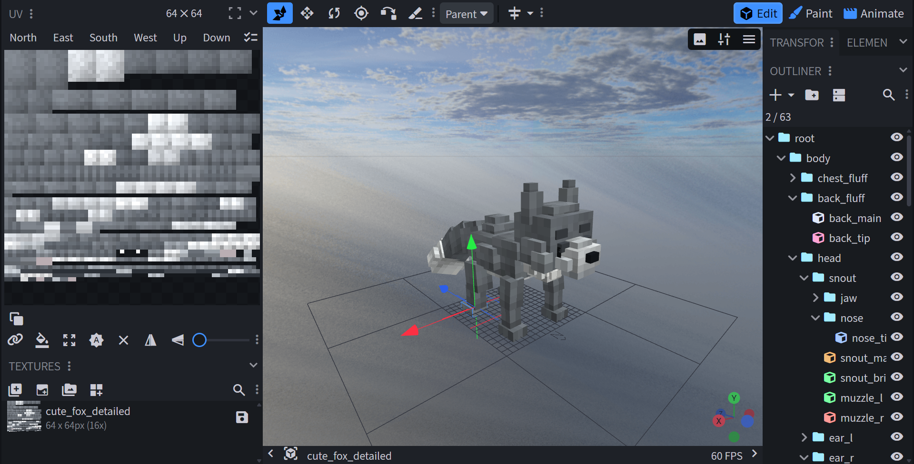

# bbmcp

Blockbench MCP 브리지 플러그인. bbmcp는 모델링, 텍스처링, 애니메이션을 위한 저수준·결정적 도구 표면을 MCP로 제공한다.

## 쇼케이스
이 결과물은 bbmcp로 수동 설정 없이 자연어만으로 5분 내 제작했다.
bone, cube, uv, texture, animation 워크플로를 지원한다.
작업 환경: codex5.3 xhigh.


| Hero Render | Texture Sheet |
| --- | --- |
|  |  |

## 기능
- 저수준 모델링만 제공: add_bone/add_cube (호출당 1개).
- 저수준 애니메이션만 제공: create_animation_clip + set_frame_pose.
- UV는 내부 처리: assign_texture -> paint_faces (수동 UV 도구 없음).
- 큐브 추가 및 geometry 변경(update_cube의 from/to/inflate) 시 자동 UV 아틀라스; 픽셀은 새 레이아웃을 따라 재투영.
- 아틀라스가 넘치면 자동으로 밀도를 낮춤(uvPixelsPerBlock 감소).
- 동시 편집 안정성을 위한 ifRevision 가드.
- 미리보기는 MCP content block(base64 PNG) + 구조화 메타데이터로 반환.
- resources/list + resources/read로 MCP 가이드 제공.

## 요구사항
- Blockbench 데스크톱(최신).
- 빌드 스크립트용 Node.js.

## 설치
```bash
npm install
npm run build
```

Blockbench에서 플러그인 로드:
- 플러그인 매니저 사용 또는 dist/bbmcp.js 수동 로드.

## 빠른 시작
1) Blockbench 실행(플러그인이 MCP 서버를 자동 시작).
2) MCP 엔드포인트 연결(기본값 아래 참고).
3) list_capabilities 호출로 스키마 + 제한 확인.

기본 엔드포인트:
```
http://0.0.0.0:8787/mcp
```
참고: 0.0.0.0은 모든 인터페이스에 바인딩한다. 로컬 전용이면 127.0.0.1 사용 권장.

## 엔드포인트 설정
설정 우선순위(높음 → 낮음):
1) Blockbench Settings (bbmcp: Server)
2) 환경 변수: BBMCP_HOST, BBMCP_PORT, BBMCP_PATH
3) 사용자 설정: %APPDATA%\bbmcp\endpoint.json (Windows) 또는 ~/.bbmcp/endpoint.json
4) 프로젝트 설정: .bbmcp/endpoint.json
5) 기본값

endpoint.json 예시:
```json
{ "host": "0.0.0.0", "port": 8787, "path": "/mcp" }
```

## 권장 흐름
프로젝트 설정:
1) ensure_project(또는 get_project_state)로 활성 프로젝트 + revision 확인.
2) 모든 변경에 ifRevision 사용.
3) validate로 빠른 이상 확인.
4) render_preview로 시각 확인.
5) export로 JSON 출력.

모델링:
- add_bone (선택)
- add_cube (호출당 1개)
- update_bone / update_cube로 수정

텍스처:
- assign_texture
- paint_faces
- render_preview

애니메이션:
- create_animation_clip
- set_frame_pose (프레임 1개씩)
- set_trigger_keyframes (선택)

노트:
- ensure_project는 텍스처가 없으면 프로젝트 이름의 텍스처를 자동 생성한다.
- UV는 내부에서 관리되며 클라이언트가 UV 데이터를 보내지 않는다.
- 큐브 추가/스케일 변경 시 자동 UV 아틀라스 수행; 필요 시 재도색 권장.

## 지원 포맷
| 포맷 | 상태 | 비고 |
| --- | --- | --- |
| Java Block/Item | 지원 | 기본 포맷. |
| GeckoLib | 지원 | capability 기반. |
| Animated Java | 지원 | capability 기반. |
| Image (2D) | 예정(TODO) | format id: `image`. |
| Generic Model | 예정(TODO) | format id: `free`. |

## 지원 한계
- 매우 큰 모델은 자동 밀도 감소 후에도 아틀라스 용량을 초과할 수 있다.
- 최대 아틀라스 bounds를 넘는 면은 uv_size_exceeds로 실패하며 지원하지 않는다.

## 도구 재탐색
toolRegistry.hash가 바뀌면 list_capabilities(또는 tools/list)를 다시 호출해 스키마를 갱신.

## 가이드 및 스펙
- docs/guides/texture-spec.md
- docs/guides/llm-texture-strategy.md
- MCP 리소스: bbmcp://guide/* (resources/templates/list 참고)

## 개발
빌드:
```bash
npm run build
```

테스트:
```bash
npm test
```

품질 검사:
```bash
npm run quality:check
```

## 커뮤니티 및 보안
- 기여 가이드: `CONTRIBUTING.md`
- 행동 강령: `CODE_OF_CONDUCT.md`
- 지원/이슈 제보: `SUPPORT.md`
- 보안 정책/취약점 제보: `SECURITY.md`
- 공개 릴리스 체크리스트: `docs/release-public-checklist.md`

## 라이선스
LICENSE 참고.
