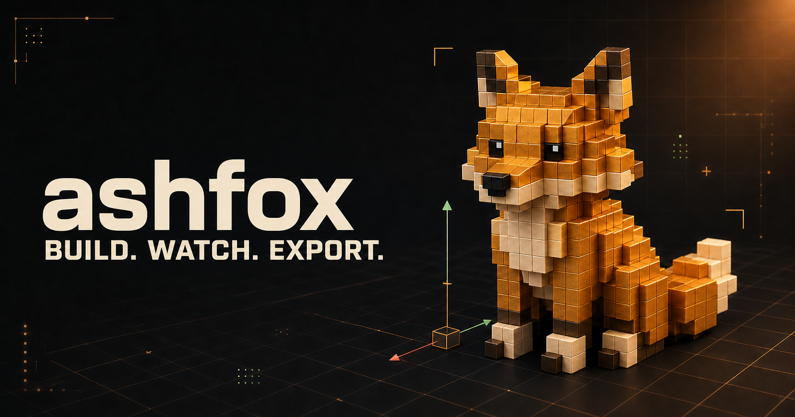
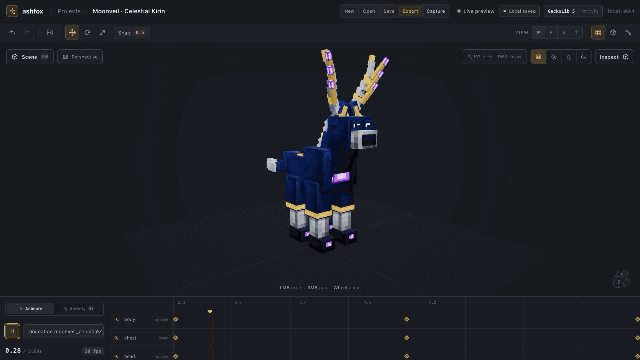
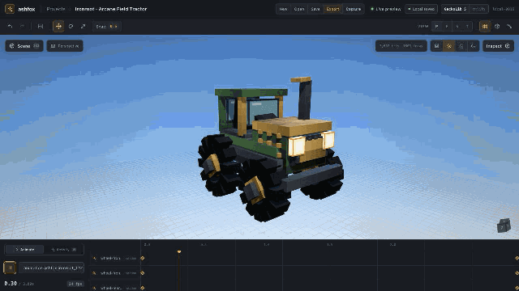
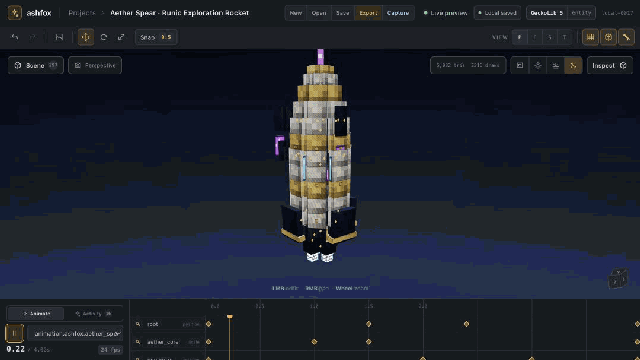

<p align="center">
  
</p>

# ashfox

ashfox is an AI-native low-poly workbench for consistent modeling, texturing,
and animation. Use the install-free web studio or connect the original
Blockbench MCP plugin to your preferred agent.

<p align="center">
  <a href="https://ashfox.io/workbench/"><strong>Open workbench →</strong></a>
  &nbsp;·&nbsp;
  <a href="#connect-blockbench-over-mcp"><strong>Connect Blockbench</strong></a>
  &nbsp;·&nbsp;
  <a href="https://ashfox.io/docs/"><strong>Read the guides</strong></a>
</p>

## Quick start — no Blockbench

[ashfox Workbench](https://ashfox.io/workbench/) runs locally in the browser with no install,
account, application server, or Blockbench runtime.

1. Open [ashfox.io/workbench](https://ashfox.io/workbench/).
2. Copy the setup prompt below into Codex desktop app, Cursor, or another agent
   that can control a browser.
3. When the agent says ashfox is ready, send your model request.

### Setup prompt

```text
Open https://ashfox.io/workbench/ in your in-app browser. If that is unavailable, use a
browser you can connect to and control. Read
https://ashfox.io/workbench/agent-manifest.json and use it as the single authority for
creating, editing, reviewing, saving, and exporting ashfox projects. Inspect
the current project and the relevant command schemas, then tell me ashfox is
ready for my model request. Do not change the project until I send that request.
```

### First model request

```text
Create a high-quality Minecraft-style fantasy kirin for GeckoLib 5,
fully modeled, textured, rigged, animated, and ready to use in a game.
```

The agent creates the project, works through the live viewport, and leaves the
result ready to review, save as `.ashfox`, or export. Blockbench is not involved.

## Watch a complete asset form


<p align="center">
  <sub>Generated by one AI agent · 131 bones · 166 cubes · 1 launch animation</sub>
</p>

This is the real ashfox workspace. One AI agent request drives validated command
batches that build an empty scene into a 297-node exploration rocket, generate
deterministic pixel-density UVs, preserve authored windows and runic accents,
and leave its launch animation ready for GeckoLib 5 validation and export.

Explore the working projects at
[ashfox.io/docs/guides/examples/](https://ashfox.io/docs/guides/examples/).

## More examples

| Celestial creature | Arcane tractor | Exploration rocket |
| --- | --- | --- |
|  |  |  |
| 113 bones · 131 cubes · living eyes | 108 bones · 125 cubes · articulated drivetrain | 131 bones · 166 cubes · animated launch rig |

## Connect Blockbench over MCP

The Blockbench compatibility track exposes deterministic modeling, texturing,
animation, validation, preview, and export tools over local MCP.

### Requirements

- Blockbench Desktop, latest stable;
- a trusted MCP client or AI agent;
- GeckoLib in the consuming mod project when you export GeckoLib assets.

### Install from the release URL

In Blockbench Desktop:

1. Open **File → Plugins → Load Plugin from URL**.
2. Paste:

```text
https://github.com/sigee-min/ashfox/releases/latest/download/ashfox.js
```

3. Choose **Install** or **Load**.

### Connect your MCP client

Keep Blockbench open with the ashfox plugin enabled, then add this HTTP MCP
endpoint to your client:

```text
http://127.0.0.1:8787/mcp
```

Check the connection:

```bash
curl -s http://127.0.0.1:8787/mcp \
  -H "Content-Type: application/json" \
  -d '{"jsonrpc":"2.0","id":1,"method":"tools/list"}'
```

Check Blockbench capabilities:

```bash
curl -s http://127.0.0.1:8787/mcp \
  -H "Content-Type: application/json" \
  -d '{"jsonrpc":"2.0","id":2,"method":"tools/call","params":{"name":"list_capabilities","arguments":{}}}'
```

### First-run permissions

#### macOS

Approve the ashfox plugin when Blockbench requests computer or filesystem
access. If macOS asks separately, allow Blockbench to access the folders where
you open and export projects.

#### Windows

Allow Blockbench on private networks if Windows Defender Firewall asks.
If Controlled Folder Access blocks saving, allow Blockbench in Windows
Security.

#### Linux

For Flatpak or Snap installations, grant access to the project and export
folders. Make sure the sandbox or firewall allows local connections to
`127.0.0.1`.

### Recommended Blockbench flow

1. Call `ensure_project` or `get_project_state` and keep the returned revision.
2. Run modeling, texture, and animation tools with `ifRevision`.
3. Call `validate`.
4. Call `render_preview`.
5. Call `export`.

Useful tool groups:

- modeling: `add_bone`, `add_cube`, `add_mesh`, updates, and deletes;
- texturing: `assign_texture`, `paint_faces`, `paint_mesh_face`,
  and `read_texture`;
- animation: `create_animation_clip`, `set_frame_pose`, and
  `set_trigger_keyframes`;
- project and delivery: `ensure_project`, `get_project_state`, `validate`,
  `render_preview`, and `export`.

### Troubleshooting

- **Plugin does not load from URL:** confirm the filename is `ashfox.js`.
- **MCP client cannot connect:** confirm Blockbench is open and the ashfox
  status shows an inline or sidecar endpoint.
- **Custom endpoint settings are lost:** edit **ashfox: Server** → **MCP Host**,
  **MCP Port**, and **MCP Path**, then reload the plugin.
- **Revision mismatch:** call `get_project_state` again and retry with the
  latest `ifRevision`.
- **Save or export is blocked:** check the operating-system folder permissions
  above.

Use only local, trusted MCP clients against your Blockbench session.

### Build the Blockbench plugin locally

```bash
git clone https://github.com/sigee-min/ashfox.git
cd ashfox
npm install
npm run build:blockbench
```

Load `dist/ashfox.js` from Blockbench's plugin manager. The build also produces
`dist/ashfox-sidecar.js`.

Prefer an install-free workflow? Open [ashfox Workbench](https://ashfox.io/workbench/) and build
the same class of assets directly in the browser.

## Product tracks

- **Web studio:** local browser projects, live 3D review, Bedrock, GeckoLib 5,
  GLB, and glTF export.
- **Blockbench MCP:** the plugin, tool schemas, Blockbench adapters,
  and local sidecar behavior.

The two tracks are built and tested independently.

## Development

```bash
npm install
npm run dev:web
npm run test
npm run build
```

Build one track independently with `npm run build:web` or
`npm run build:blockbench`. Build the complete deployable web surface with
`npm run build:public`; it emits the landing page at `/`, workbench at
`/workbench/`, and
documentation below `/docs/` in `dist/public`. Preview the same bundle with
`npm run preview:public`.

User guides for setup, authoring, files, formats, and troubleshooting live in
[`docs/`](docs/README.md).

## License

MIT. See `LICENSE`.
