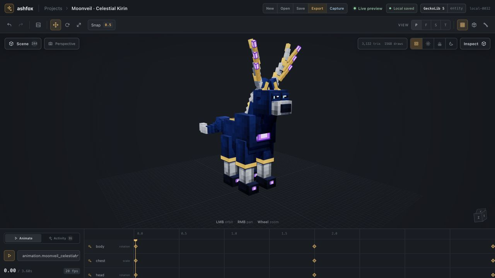

<p align="center">
  
</p>

# Ashfox

Ashfox is an AI-native low-poly workbench for consistent modeling, texturing,
and animation. It runs in the browser, owns project data locally, and requires
no account, server, local daemon, or Blockbench runtime.

## Quick start

Paste this into your AI IDE:

```text
Open https://ashfox.io in the in-app browser. Create a new Ashfox project and
build a highly detailed low-poly truck with consistent modeling, texturing,
and animation. Review the result in the live viewport.
```

## One consistent asset pipeline


<p align="center">
  <sub>Generated by one AI IDE agent · 113 bones · 131 cubes · 2 animation clips</sub>
</p>

This is the real Ashfox workspace. One AI IDE request drives validated command
batches that build an empty scene into a 244-node celestial creature, generate
deterministic pixel-density UVs, preserve authored eye and astral accents, and
leave two animation clips ready for GeckoLib 5 validation and export.

## Consistent across every asset

| Celestial creature | Arcane tractor | Exploration rocket |
| --- | --- | --- |
|  |  |  |
| 113 bones · 131 cubes · living eyes | 108 bones · 125 cubes · articulated drivetrain | 131 bones · 166 cubes · animated launch rig |

An optional Blockbench compatibility track remains available for existing MCP
workflows. It is built and tested independently and cannot be imported by the
web product.

## Product tracks

### AI-native low-poly workbench

- one canonical `ProjectDocument` with stable IDs;
- compact Three.js viewport for agent-authored results;
- browser-local revision history and persistence;
- Bedrock, GeckoLib 5, glTF 2.0, GLB, and Minecraft Java export;
- no install, account, backend provider, or Blockbench runtime.

### Blockbench MCP compatibility

- existing MCP tools, schemas, Blockbench adapters, and sidecar behavior;
- isolated packages under `packages/blockbench-*`;
- optional artifacts `dist/ashfox.js` and `dist/ashfox-sidecar.js`.

## Development

```bash
npm install
npm run dev:web
npm run test
npm run build
```

Build one track independently with `npm run build:web` or
`npm run build:blockbench`. Build the complete deployable web surface with
`npm run build:public`; it emits the workbench at `/`, landing at `/home/`, and
documentation below `/docs/` in `dist/public`. Preview the same bundle with
`npm run preview:public`.

Architecture, product, UX, and migration contracts are maintained in
[`docs/`](docs/README.md).

## License

MIT. See `LICENSE`.
