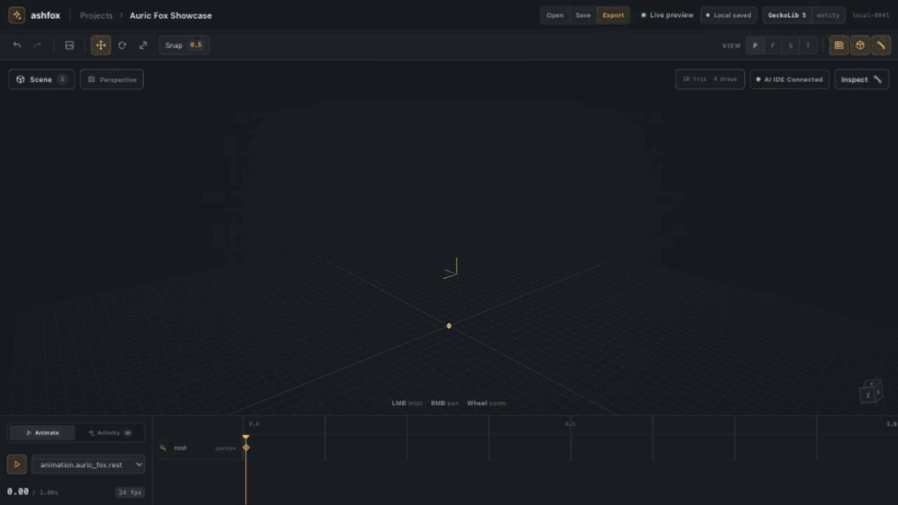

<p align="center">
  
</p>

# Ashfox

Ashfox is a zero-install web studio for deterministic 3D modeling, texturing,
animation, validation, and export. The browser product owns its project data
locally and does not require Blockbench, a local daemon, a database server, or
an MCP connection.

## From a prompt to a game-ready asset



This is the real Ashfox workspace. One AI IDE request drives validated command
batches that build an empty scene into a 62-node Minecraft-style fox, generate
a deterministic 512 × 512 UV atlas, and leave three animation clips ready for
GeckoLib 5 validation and export.

An optional Blockbench compatibility track remains available for existing MCP
workflows. It is built and tested independently and cannot be imported by the
web product.

## Product tracks

### Web Studio

- one canonical `ProjectDocument` with stable IDs;
- compact Three.js workbench optimized for agent-authored results;
- browser-local revision history and persistence;
- Bedrock, GeckoLib 5, glTF 2.0, GLB, and Minecraft Java export;
- no install, account, backend provider, or Blockbench runtime.

### Blockbench MCP compatibility

- existing MCP tools, schemas, Blockbench adapters, and sidecar behavior;
- isolated packages under `packages/blockbench-*`;
- optional artifacts `dist/ashfox.js` and `dist/ashfox-sidecar.js`.

## Development

```bash
npm install
npm run dev:web
npm run test
npm run build
```

Build one track independently with `npm run build:web` or
`npm run build:blockbench`. Build the dependency-free public landing and
documentation site with `npm run build:site`.

Architecture, product, UX, and migration contracts are maintained in
[`docs/`](docs/README.md).

## License

MIT. See `LICENSE`.
