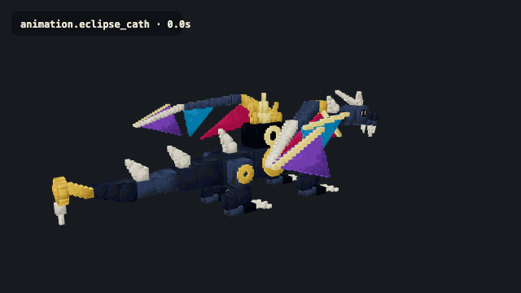
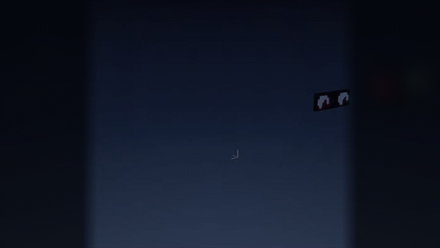
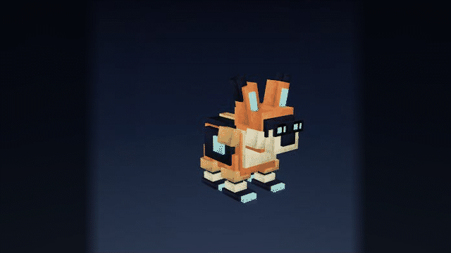
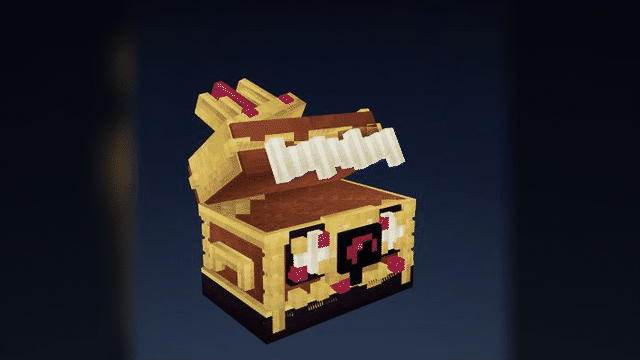
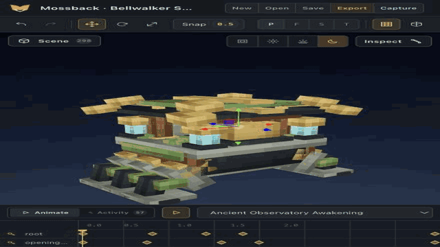
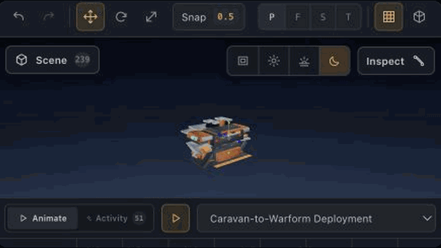

<p align="center">
  
  <br>
  <sub><strong>GPT-5.6 Sol xhigh</strong> · modeled, textured, rigged, and animated · 230 bones · 215 cubes · 2,580 exported triangles · 1 GLB primitive</sub>
</p>

# ashfox — AI-native low-poly asset workbench

Describe an asset and watch your AI agent model, texture, rig, and animate it in
an editable browser workbench. Keep the canonical `.ashfox` source, then export
runtime-optimized Bedrock, GeckoLib 5, glTF, or GLB output. A fully supported
Blockbench MCP workflow is included for teams already using Blockbench.

<p align="center">
  <a href="https://ashfox.io"><strong>Explore ashfox.io →</strong></a>
  &nbsp;·&nbsp;
  <a href="https://ashfox.io/gallery/"><strong>Open the demo gallery →</strong></a>
  <br>
  <sub>Build complete low-poly assets with your AI agent—no modeling app required.</sub>
</p>

<p align="center">
  <a href="#connect-blockbench"><strong>Connect Blockbench</strong></a>
  &nbsp;·&nbsp;
  <a href="#use-without-blockbench"><strong>Use without Blockbench</strong></a>
  &nbsp;·&nbsp;
  <a href="#editable-demo-gallery"><strong>Demo gallery</strong></a>
  &nbsp;·&nbsp;
  <a href="https://ashfox.io/docs/"><strong>Read the guides</strong></a>
</p>

## Choose the workflow you want

| | Blockbench MCP | Web workbench |
| --- | --- | --- |
| Best for | Existing Blockbench workflows | Starting without installing a modeling app |
| Setup | Load one plugin and connect localhost MCP | Give your agent one manifest instruction |
| Workspace | Your open Blockbench project | A browser-local `.ashfox` project |
| Agent access | MCP tools | Connected or in-app browser |
| Exports | Blockbench-supported targets | Java block, GeckoLib 5, Bedrock, GLB, and glTF |

Both workflows are open source and local-first. The web workbench is optional;
you do not need to switch away from Blockbench.

## Connect Blockbench

### 1. Install the plugin

In the latest Blockbench Desktop:

1. Open **File → Plugins → Load Plugin from URL**.
2. Paste the release URL below.
3. Choose **Install** or **Load**.

```text
https://github.com/sigee-min/ashfox/releases/latest/download/ashfox.js
```

This URL loads the published `ashfox.js` asset from this GitHub repository.
The plugin opens a local MCP endpoint on your machine; it does not require an
ashfox account or a connection to `ashfox.io`.

### 2. Connect your agent

Keep Blockbench open, then add this HTTP MCP endpoint to your agent or MCP
client:

```text
http://127.0.0.1:8787/mcp
```

Ask the agent to confirm the connection before it edits anything:

```text
Connect to the Blockbench MCP endpoint, call list_capabilities, inspect the
current project, and tell me which modeling, texture, animation, preview, and
export tools are available. When the connection check is complete, ask me
exactly: "What would you like to create?" Treat my next message as the complete
asset brief and begin unless one required target detail is missing. Do not
change the project until I answer.
```

### 3. Make your first asset

Once the agent reports that Blockbench is connected:

```text
Create a Minecraft-style fantasy creature with a readable silhouette,
consistent pixel textures, a clean bone hierarchy, and an idle animation.
Validate it and render a preview before exporting.
```

That is the complete setup. You can stay entirely inside Blockbench.

<details>
<summary><strong>Verify the endpoint manually</strong></summary>

List the available tools:

```bash
curl -s http://127.0.0.1:8787/mcp \
  -H "Content-Type: application/json" \
  -d '{"jsonrpc":"2.0","id":1,"method":"tools/list"}'
```

Read the active Blockbench capabilities:

```bash
curl -s http://127.0.0.1:8787/mcp \
  -H "Content-Type: application/json" \
  -d '{"jsonrpc":"2.0","id":2,"method":"tools/call","params":{"name":"list_capabilities","arguments":{}}}'
```

</details>

<details>
<summary><strong>If the plugin or endpoint does not connect</strong></summary>

- Confirm that you are using the latest Blockbench Desktop.
- Confirm that the loaded file is named `ashfox.js`.
- Keep Blockbench open while the MCP client connects.
- Check **ashfox: Server** for the host, port, path, and current status.
- Allow Blockbench on private networks if the operating system asks.
- On Flatpak or Snap, allow access to the project and export folders.
- If a command reports a revision mismatch, inspect the project again and use
  the latest `ifRevision`.

</details>

## What the Blockbench integration exposes

- **Modeling:** bones, cubes, meshes, transforms, updates, and deletes.
- **Texturing:** assignment, deterministic face painting, mesh painting, and
  texture reads.
- **Animation:** clips, frame poses, triggers, and keyframes.
- **Review:** project state, validation, capability inspection, and rendered
  previews.
- **Delivery:** export through the active Blockbench project and format.

Normal edits use revisions so an agent cannot silently apply work against stale
project state. Use only trusted local MCP clients because connected tools can
edit the project currently open in Blockbench.

## Use without Blockbench

Paste this single instruction into Codex desktop app, Cursor, or another
browser-capable agent:

```text
Fetch and follow https://ashfox.io/workbench/agent-manifest.json using a direct HTTP request such as curl.
```

That manifest is the complete operating guide. It tells the agent how to open
ashfox, connect to the page, inspect the project, edit safely, and ask what you
want to create.

The workbench keeps its editable project in the browser. Files leave it only
when the agent delivers the validated target artifact.

## See the web workbench build an asset

The recording below is from the optional web workbench, beginning with an empty
project.



<p align="center">
  <sub>One agent · 230 bones · 215 cubes · articulated cathedral-dragon rig</sub>
</p>

| Brand guardian | Creature boss | Walking shrine |
| --- | --- | --- |
|  |  |  |
| 133 bones · 123 cubes | 137 bones · 125 cubes | 155 bones · 143 cubes |

| Mobile war-forge | Cathedral wyrm |
| --- | --- |
|  |  |
| 125 bones · 114 cubes | 230 bones · 215 cubes |

Every showcase above exports as one GLB base-pass primitive.

## Editable demo gallery

Every gallery entry is a self-contained folder under
[`examples/gallery/`](examples/gallery/README.md). It contains one `demo.json`
manifest, its media, and the exact `project.ashfox` source. The website discovers
these folders automatically, exposes name search and category filters, and opens
the selected archive directly in the workbench.

The Aether Spear Rocket is also held to automated delivery budgets: one GLB
base-pass primitive, a GLB below 100 KB, and GeckoLib/Bedrock JSON below 70 KB.
These checks protect the editable source while keeping exported game assets
small and draw-call efficient.

## Local data and source

- The Blockbench plugin and MCP endpoint run on your machine.
- The web workbench does not require an ashfox account or project upload.
- The browser and Blockbench workflows are built and tested independently.
- Source for the plugin, sidecar, engine, workbench, and site is in this
  repository under the MIT license.

## Build from source

```bash
git clone https://github.com/sigee-min/ashfox.git
cd ashfox
npm install
npm run build
```

The Blockbench build produces `dist/ashfox.js` and
`dist/ashfox-sidecar.js`. To build or test one surface:

```bash
npm run build:blockbench
npm run build:public
npm test
```

See [CONTRIBUTING.md](CONTRIBUTING.md) for repository conventions and
[docs/](docs/README.md) for user guides.

## License

MIT. See [LICENSE](LICENSE).
