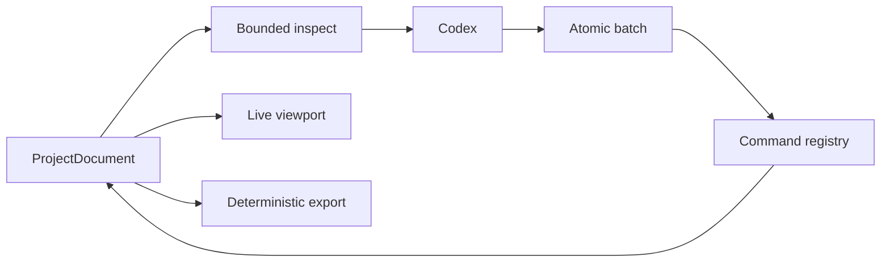

# AI-Native Authoring

Status: **Accepted**

Implementation: **Planned**

## Loop

`ProjectDocument` is the project authority. The command registry is the
mutation authority. React and Codex use the same commands.

The browser surface is defined in
[Agent Command Port](agent-command-port.md).
The evidence and operating policy are summarized in
[Single-agent quality per token](../research/single-agent-quality.md).

## Context

The default inspection contains only:

- project, revision, and target;
- current selection;
- entity counts;
- locally valid deterministic tools;
- one blocking path.

It is capped at 2 KB. A requested command schema or entity detail is capped at
4 KB and ten IDs. Normal AI input contains these bounded projections.

## Commands

A batch represents one meaningful change. Coarse deterministic commands handle
primitive creation, multi-node transforms, duplication, mirroring, hierarchy,
UV operations, animation keys, validation, and export.

The browser binds session identity. The AI sends only base revision and command
inputs.

## Local checks

The browser rejects:

- invalid payloads;
- missing or cyclic references;
- non-finite geometry, UV, or animation values;
- unsupported target features;
- unresolved required assets or export paths.

The checks are deterministic and consume no AI turn. Failure returns one error
code and path. Success returns revision and affected IDs.

## Observation

Every committed batch renders immediately. Codex observes the viewport only
after a visual change or when requested by the creator. Normal edits use zero
or one screenshot.

## Budget

| Surface | Limit |
| --- | ---: |
| Default inspection | 2 KB |
| Requested inspection | 4 KB |
| Run result | 1 KB |
| Screenshot | zero or one |

## Success criteria

- one batch replaces repetitive field edits;
- deterministic tools are easy to discover and use;
- normal work uses bounded project projections;
- validation consumes zero AI turns;
- every change is visible and undoable;
- target export remains deterministic.
