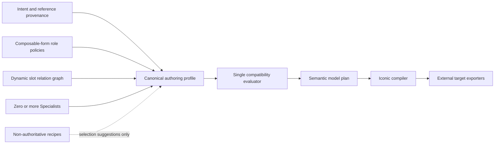

# Authoring Authority Harness

Status: accepted; the pre-release contract is a hard cut with no predecessor
compatibility contract.

This document defines the single authoring authority model for reference-driven
asset work. It complements the normative geometry compiler in
[Iconic Hardcut Modeling](iconic-hardcut-modeling.md). Only exported game and
tool artifacts are compatibility promises; internal authoring records accept
exactly the current explicit contract.

## Authority model

The sole `Archetype` is a subject-neutral composable-form authority. It owns
the closed structural-role language, allowed part kinds and quality stages,
capabilities, review checks, and every attachment port the plan can provide.
It does not own named body plans or precomposed combinations.

A `Specialist` is a focused contribution policy. It declares facets,
capabilities, attachment requirements, topology-free contributions, optional
motion binding requirements, compatibility clauses, and review checks. A
specialist never provides a port and never owns body topology.

The profile contains the explicit
`{id: "archetype.composable-form", version: 1}` reference, explicit versioned
specialist references, authority claims, dynamic slot declarations,
attachment or motion bindings, and a routing snapshot. String
shorthand, missing versions, unknown fields, migration aliases, and inferred
defaults are invalid.

Each structural slot declares one neutral role (`core`, `axis`, `articulated`,
`span`, `focal-frame`, or `accent`), one quality stage, stable part IDs, parent
slot IDs, spatial relations, optional pairing, facing, and contact intent.
There is exactly one `core + silhouette` root and every other slot must connect
to it through a DAG. A pair is declared by shared `pairId`; meaning never comes
from a hyphenated combination name or slot-name convention.

## Provenance

Every authority declares closed evidence criteria. Every selected authority's
required criterion has a claim with a current authority reference, matching
`criterionId`, `basis`, `referenceIds`, and a non-empty rationale.

- `observed` claims may reference only IDs that exist in the current
  `ProjectIntent.references` collection. The routing snapshot includes the
  complete reference records, including a supplied content hash.
- `requested` claims may reference only `intent.subject` or an existing
  `intent.features.N` path.

Changing intent, references, their content hashes, or the external delivery
target makes the routing snapshot stale. The profile must then be replaced
through `project.authoring.configure`.

## Attachment and motion bindings

An attachment binding atomically identifies:

- one selected specialist contribution;
- one port provided by the selected archetype;
- one concrete host slot whose structural role is allowed by that port; and
- the stable part IDs owned by the contribution.

The evaluator rejects unknown hosts, wrong port types, disallowed facets,
capacity overflow, duplicate contribution bindings, missing required
contributions, and part IDs owned by more than one slot or binding. Parent
topology is injected from the selected host; the specialist contribution
cannot encode it.

A motion binding atomically identifies one selected specialist reference,
one clip ID, and one allowed role. A clip has one binding, and a specialist's
binding cardinality and role come from its data definition. Review checks for
a clip are selected through that binding, so checks from another motion
specialist cannot leak into the review.

## One compatibility language

Only `compatibilityEvaluator.ts` interprets compatibility clauses. The current
language is a closed discriminated union:

| Operator | Meaning |
| --- | --- |
| `equals` | A scalar path has the declared typed value. |
| `includes` | A selected facet, capability, or specialist set contains a typed value. |
| `forbids` | A selected set must not contain a typed value. |
| `requires-port` | The archetype provides the declared port type. |
| `provides-capability` | Another selected authority provides the required capability. |

Capabilities and forbids are evaluated from complete sets, independent of
specialist order. The injectable catalog validator rejects unknown taxonomy
values, malformed records, non-finite cardinalities, topology cycles,
self-satisfying or circular capability requirements, and contradictory
clauses before the catalog can be exposed.

## Runtime boundaries

The authoritative runtime path is:

1. `project.intent.set` establishes requested and observed provenance.
2. `project.authoring.configure` validates and stores the canonical profile.
3. The compatibility evaluator validates the complete authority selection and
   bindings.
4. The authoring plan evaluator checks routing, model ownership, topology,
   spatial rules, facing, and bound motion clips.
5. Production readiness converts those findings into blocking findings.
6. Exporters enforce only the receiving game's or tool's compatibility rules.

Concrete asset cases live only in `authoringRecipes.ts`. Each recipe is marked
`role: "non-authoritative"` and can suggest authority selections, claims,
slots, and bindings. It cannot produce compiler input. Command execution,
model compilation, validation, and readiness must not import or inspect that
module.

## Future composition boundary

`Assembly` is intentionally not implemented in the current contract. There is
no Assembly type, command, document field, evaluator, or compiler path. If
multi-asset composition is later required, it must receive a separate
versioned contract and cannot be smuggled into specialist ports, bindings, or
recipes.
