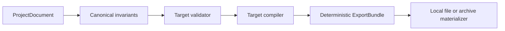

# Export Target Architecture

Status: **Implemented core**

## Boundary

The canonical `ProjectDocument` is target-neutral. Export never mutates it and never makes a target-specific JSON object the source of truth.



The implementation is organized by responsibility:

```text
packages/engine-core/src/export/
├── shared/
│   ├── minecraftGeometry.ts
│   └── minecraftAnimation.ts
└── targets/
    ├── bedrock/exporter.ts
    ├── geckolib5/exporter.ts
    ├── gltf/
    │   ├── animationCompiler.ts
    │   ├── binaryWriter.ts
    │   ├── exporter.ts
    │   ├── glb.ts
    │   ├── sceneCompiler.ts
    │   └── types.ts
    └── javaBlock/exporter.ts
```

Bedrock and GeckoLib 5 share coordinate and actor-animation compilers because their geometry and animation payloads are structurally related. They do not share profile validation, output layout, target IDs, or bundle entrypoints. glTF/GLB has an independent scene, binary, material, and animation pipeline.

The shared animation compiler is dialect-aware:

- Bedrock keyframe objects emit schema-compatible `pre`, `post`, and optional `lerp_mode` fields; STEP and GeckoLib easing are rejected.
- GeckoLib 5 keyframe objects may emit `vector`, `pre`, `post`, `lerp_mode`, `easing`, and `easingArgs` as accepted by its actor-animation decoder.
- Bedrock preserves arrays of effects or timeline expressions at one timestamp.
- GeckoLib 5 currently expects a single decoded entry per effect or timeline timestamp, so arrays fail validation instead of being flattened.
- `start_delay`, `loop_delay`, `anim_time_update`, `blend_weight`, `override_previous_animation`, and entity-relative rotation have canonical typed fields.

## Target contracts

| Target | Geometry | Animation | Texture | Rejected data |
| --- | --- | --- | --- | --- |
| `minecraft.bedrock` | bones, cubes, locators | actor animation 1.8.0, Molang, sound, particle, timeline | PNG | freeform meshes, STEP/Gecko easing, duplicate names/channels/timestamps, unbaked scale |
| `minecraft.java.geckolib5` | GeckoLib 5 `.geo.json` layout using compatible Minecraft geometry data | named `.animation.json`, Molang and effect tracks | PNG | freeform meshes, missing animation set, duplicate names/channels/timestamps |
| `gltf.2` | nodes, cubes, triangulated meshes, materials | numeric TRS channels using LINEAR or STEP | PNG or JPEG | Molang, effect tracks, Catmull-Rom, per-key envelopes/easing |

Target rejection is deliberate. An exporter must fail with structured findings when the destination cannot preserve source intent.

## Bedrock bundle

Profile: `minecraft.bedrock`

```text
resource-pack/
├── models/blocks/<modelPath>.geo.json
│   or models/entity/<modelPath>.geo.json
├── animations/<animationPath>.animation.json
└── textures/<resourcePath>.png
```

The animation file is emitted only when clips exist. Geometry converts canonical right-handed X coordinates and rotations to the Minecraft representation. Animation channels use the same conversion and resolve bone and locator IDs only after uniqueness validation.

## GeckoLib 5 bundle

Profile: `minecraft.java.geckolib5`

```text
resource-pack/
└── assets/<namespace>/
    └── geckolib/
        ├── models/<entity|block|item>/<modelPath>.geo.json
        └── animations/<entity|block|item>/<animationPath>.animation.json

assets/<textureNamespace>/textures/<resourcePath>.png
```

The exporter is implemented locally and does not import GeckoLib code. Ashfox
compatibility ends at the validated deterministic asset bundle; runtime loader
integration is outside the product boundary.

## glTF and GLB bundle

Profile: `gltf.2`

For `container: 'gltf', imageStorage: 'external'`:

```text
gltf/
├── <modelPath>.gltf
├── <modelPath>.bin
└── textures/texture_<index>.<png|jpg>
```

For `container: 'glb', imageStorage: 'external'`:

```text
gltf/
├── <modelPath>.glb
└── textures/texture_<index>.<png|jpg>
```

For `container: 'glb', imageStorage: 'embedded'`:

```text
gltf/
└── <modelPath>.glb
```

`imageStorage: 'embedded'` is invalid with the JSON `.gltf` container. In the embedded GLB path, every PNG or JPEG is resolved from its immutable `BlobRef`, appended to the GLB BIN chunk as a four-byte-aligned buffer view, and referenced by `images[].bufferView` plus `mimeType`. The result contains no image URI and no `blob-copy` sidecar.

engine-core still performs no storage I/O. `exportGltfResolved()` and `exportProjectResolved()` accept an async `BlobResolver`; the browser, IndexedDB adapter, or local filesystem adapter owns the actual read. Missing blobs, read failures, invalid byte values, content-type mismatches, and declared byte-length mismatches fail with typed resolution errors. The synchronous exporter rejects an embedded profile with textures so callers cannot accidentally emit an incomplete GLB.

Pixel coordinates are converted at `1/16` glTF units. Block and meter coordinates use scale `1`. Rest translation, quaternion rotation composition, and rest scale are included in animation outputs because glTF animation channels replace node TRS values. When a canonical channel begins after time zero, the compiler inserts an implicit rest-pose key at zero so the pre-roll is not replaced by the first authored value. When it ends before the clip duration, the last value is repeated at the duration boundary so standard glTF players retain the authored clip length.

## Determinism

- Nodes, textures, clips, and channels are ordered by stable ID.
- JSON keys are sorted by the bundle serializer.
- Minecraft timestamps are normalized to four decimal places and collisions fail validation.
- Binary buffer views are aligned to four bytes.
- Embedded images are ordered by stable texture ID and preserve their exact resolved bytes.
- GLB headers and chunks use the glTF 2.0 little-endian layout.
- Output paths are derived only from validated profiles and generated texture indices.

## Conformance evidence

- Java block fixture: `packages/engine-core/tests/fixtures/minecraft-java-block.json`
- Bedrock geometry fixture: `packages/engine-core/tests/fixtures/minecraft-bedrock-geometry.json`
- GeckoLib 5 geometry fixture: `packages/engine-core/tests/fixtures/geckolib5-geometry.json`
- GeckoLib 5 animation fixture: `packages/engine-core/tests/fixtures/geckolib5-animation.json`
- GLB header, buffer, scene, animation, embedded-image byte identity, and typed resolution-error assertions: `packages/engine-core/tests/gltfExporters.test.ts`
- [Khronos glTF Validator](https://github.com/KhronosGroup/glTF-Validator) conformance for generated external-resource glTF/GLB and self-contained GLB bundles: `packages/engine-core/tests/gltfExporters.test.ts`
