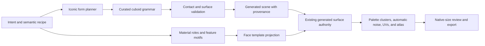

# Iconic Hardcut Modeling

Status: accepted and implemented on `feature/iconic`

This is the normative modeling direction for new Ashfox authoring. The
[legacy occupancy kernel](legacy-occupancy-modeling.md) is retained only as
history and archive context.

## Decision

Ashfox keeps its UX, semantic authoring API, canonical document, generated
texture system, review workflow, and exporters. It replaces the internal form
compiler with a deterministic iconic cuboid grammar.

The hardcut is defined by five rules:

1. Geometry communicates silhouette, depth, articulation, and defining
   three-dimensional identity.
2. The compiler emits a small, intentional arrangement of cuboids directly;
   it does not discover style by compressing a finely rasterized volume.
3. The agent specifies semantic form, material roles, and bounded features. It
   never paints texels or controls noise.
4. Ashfox retains full authority over palette clusters, directional tone,
   automatic noise, UVs, surface continuity, rasterization, and atlas packing.
5. Eyes, noses, mouths, and other focal face marks use deterministic
   templates rather than free-form geometry or free-form painting.

There is no artistic cube-count ceiling. A simple subject should compile to a
few cuboids because of its form grammar, not because a numeric gate forces it.
Additional cuboids are valid when they carry real silhouette, depth,
articulation, or identity.

## Stable external boundary

The following product surfaces remain stable:

- workbench layout, scene tree, inspection, review, capture, and delivery;
- `project.create`, project intent, and `model.parts.*` command workflows;
- semantic `mass`, `segment`, `plate`, `radial`, and `feature` part objects;
- `ProjectDocument`, semantic hierarchy, joints, and material references;
- generated `BoneNode` and `CubeNode` scene output;
- generated texture, UV-atlas, viewport, and export consumers.

The feature object remains the common zero-depth surface API. Extending its
`motif` vocabulary is additive; it does not introduce a bitmap or raw-pixel
endpoint.

Generated cubes remain implementation artifacts. The scene tree presents
semantic parts and surface features, not a raw cube-editing workflow.

## Replaced internal boundary

The hardcut replaces these form-authoring responsibilities:

- superellipsoid mass rasterization as the normal shape source;
- continuous segment rasterization followed by cell compression;
- surface-conforming decomposition as the primary style generator;
- density as a route to smaller geometric details;
- anatomical heuristics that reward extra eye-support geometry;
- direct or inferred per-texel painting by an agent;
- cuboid-count rejection as a quality proxy.

Cross-part seam ownership may subtract hidden overlap from a selected template
and leave several rectangular groups. It never reconstructs a sampled curve.
Partially covered cube faces remain rectangular, and any tolerated overdraw is
restricted to already occupied model volume.

## Runtime pipeline

The same normalized recipe and current grammar must produce identical cuboid
bounds, hierarchy, pivots, feature pixels, noise, raster, atlas, and generated
IDs.

## Iconic form grammar

### Mass

`profile: "block"` emits the exact primary cuboid and remains the default.
Other profiles do not request a smoothly sampled superellipsoid. They select a
bounded stepped-layout family whose cuboids describe only silhouette-changing
shoulders, caps, cheeks, or taper.

The template may scale with the authored radii, but its topology and layering
are fixed by the grammar family. Increasing size does not
automatically increase geometric frequency.

### Segment

A segment compiles control-point spans into a short proximal-to-distal cuboid
chain. A new cuboid is justified by a meaningful bend, thickness transition,
joint boundary, or silhouette step. It is not generated for every sampled path
cell.

### Plate

A plate compiles its rectangle, triangle, or trapezoid into a bounded stepped
silhouette. Thin plates remain useful for wings, ears, blades, fins, cloth
panels, and furniture surfaces. They are not allowed as hidden carriers for
facial marks.

### Radial

A radial selects a small stepped disk or ring layout appropriate to its size
bucket. Larger radius changes proportion, not unlimited ring subdivision.

### Contact and articulation

The compiler rederives parent contact, anchors, and pivots from the selected
forms. It may subtract hidden overlap or move a nearby child by at most two
model blocks to establish a shared face, but it preserves the authored
hierarchy and visible proportions.

Derived occupancy is computed from emitted cuboids for:

- overlap and collision checks;
- root cohesion and parent-mediated child cohesion;
- external-face classification;
- surface-feature support;
- export and projection validation.

Occupancy verifies the chosen form. It no longer invents that form.

## Deterministic face templates

Facial identity is a surface-language problem unless a feature changes the
silhouette. Eyes, noses, and mouths therefore use host-face templates.

Each template is defined in face-local integer coordinates and contains color
roles rather than RGB values. Typical roles include:

- `outline`;
- `iris`;
- `pupil`;
- `nose`;
- `mouth`;
- `fang`;
- `beak`;
- neutral `field` fill.

The focal motif families are:

- `eye`: `dot`, `square`, and `slit` glyphs;
- `nose`: `dot` and `snout` glyphs;
- `mouth`: `neutral`, `fang`, and `beak` glyphs;
- `patch`: a bounded material region for muzzles, bellies, masks, panels,
  stripe blocks, and other color-only identity cues.

Template selection may use only normalized semantic inputs, declared motif,
host-face dimensions, facing direction, and compact size. The public anchor is
a preferred location; the compiler projects the full template rectangle onto
the nearest valid uncovered host surface. It does not infer behavior from
arbitrary `partId` wording or randomness.

The public API does not expose the role grid, pixel coordinates, gradients,
highlight positions, arbitrary expressions, or noise parameters. An additive
motif or glyph option is acceptable when a new semantic distinction is
required.

### Face rendering rule

General material surfaces retain the existing directional three-tone clusters
and deterministic automatic noise. Focal face-template pixels use flat role
colors where needed so the eye, nose, or mouth remains readable. A surrounding
`patch` inherits the ordinary generated shading and noise.

Eyes, noses, and mouths must not become eyeball cubes, sockets, face plates,
billboards, or miniature realistic renderers. A protruding muzzle, beak, or
horn remains geometry only when it changes the silhouette.

## Generated texture authority remains unchanged

Automatic texture synthesis is a retained core capability, not an intermediate
workaround. An AI agent cannot reliably choose coherent pixels, hue steps,
lighting, and noise across an atlas.

The agent owns:

- a small role-based base palette;
- material assignment to semantic parts;
- semantic feature motif, face, anchor, and extent.

Ashfox owns:

- quantized palette clusters;
- directional face tones;
- deterministic multi-scale clustered noise;
- continuous oriented pattern coordinates across generated cuboids;
- UV gutters, rasterization, and atlas packing.

The public API must not accept bitmaps, texel lists, arbitrary per-pixel colors,
noise sliders, gradient stops, or highlight coordinates.

## Quality contract

Quality is enforced by grammar and review rather than a maximum cube count.

A generated cuboid is meaningful when it contributes to at least one of:

1. silhouette;
2. visible depth or overlap;
3. articulation or pivot ownership;
4. a defining three-dimensional identity cue;
5. target-format correctness that cannot be represented by a larger cuboid.

`formComposition` may report semantic part count, emitted cuboid count, and
cell-scale output. These are diagnostics for unexpected fragmentation, never a
pass/fail score.

Every accepted asset still requires native-size front, side, top, and
three-quarter review. The review rejects lost silhouettes, incorrect body
plans, unreadable faces, reversed limbs, accidental symmetry, disconnected
parts, and details that exist only when zoomed in.

## Hard-cut projection policy

There is one active modeling compiler and no legacy style selector,
compatibility branch, or migration mode.

- Every semantic recipe projects through the current iconic grammar.
- A project file whose materialized scene does not match that projection is
  invalid and must be rebuilt, not routed to the old rasterizer.
- Animations continue to target semantic bones, not generated cube IDs.
- Generated texture and atlas metadata is always regenerated from the current
  accepted hardcut geometry.
- The external command, document, workbench, review, and export boundaries
  remain stable even though generated cube bounds may change at the hard cut.

## Verification

The hardcut is complete only when tests prove:

- public commands and inspection retain their established shapes;
- isolated block masses emit one cuboid;
- scaled forms keep bounded template topology rather than gaining sampling
  frequency;
- segment bends and thickness changes produce stable intentional steps;
- emitted cuboids pass contact, overlap, external-face, and export invariants;
- face templates produce exact role grids for every supported size bucket;
- eyes, noses, mouths, and patches create no accidental geometry;
- general surfaces preserve automatic noise and cuboid-to-cuboid continuity;
- the same recipe reproduces byte-identical generated
  structure and texture metadata;
- golden native-size renders cover creature, humanoid, prop, furniture,
  vehicle, and radial-form archetypes.

## Non-goals

- No raw-cube or raw-pixel authoring API for agents.
- No global lossy simplifier that changes an accepted silhouette afterward.
- No arbitrary style preset or template-parameter matrix.
- No numeric cube budget presented as artistic quality.
- No realistic iris, skin, or material renderer.
- No subject-specific hardcoding hidden behind part names.
- No legacy compiler switch or dual projection path.
