# Iconic Hardcut Modeling

Status: accepted and implemented on `feature/iconic`

This is the one normative modeling direction for Ashfox authoring.

## Decision

Ashfox keeps its UX, semantic authoring API, canonical document, generated
texture system, review workflow, and exporters. The
[authoring authority harness](authoring-authority-harness.md) supplies bounded
semantic plans through one composable structural authority and neutral
specialists, while this hardcut replaces the internal form compiler with one
deterministic iconic cuboid grammar. There is no named body-plan selection.

The hardcut is defined by five rules:

1. Geometry communicates silhouette, depth, articulation, and defining
   three-dimensional identity.
2. The compiler emits a small, intentional arrangement of cuboids directly;
   it does not discover style by compressing a finely rasterized volume.
3. The agent specifies semantic form, material roles, and bounded features. It
   never paints texels or controls noise.
4. Ashfox retains full authority over palette clusters, directional tone,
   automatic noise, UVs, surface continuity, rasterization, and atlas packing.
5. Eyes, noses, mouths, and other focal face marks use deterministic
   templates rather than free-form geometry or free-form painting.

There is no artistic cube-count ceiling. A simple subject should compile to a
few cuboids because of its form grammar, not because a numeric gate forces it.
Additional cuboids are valid when they carry real silhouette, depth,
articulation, or identity.

## Compatibility boundary

Only delivered target artifacts are compatibility promises. Java resource
packs, Bedrock geometry and animations, GeckoLib 5 assets, and glTF 2.0 output
must continue to satisfy the selected external game or tool contract.

Ashfox is pre-release. Its project document, commands, semantic recipes,
generated scene, and compiler caches are one internal v2 authority, with no
migration reader or alternate compiler. A breaking internal improvement
replaces the current version in place until the first release. Generated cubes remain
implementation artifacts; semantic parts and surface features remain the only
authoring authority.

## Replaced internal boundary

The hardcut replaces these form-authoring responsibilities:

- superellipsoid mass rasterization as the normal shape source;
- continuous segment rasterization followed by cell compression;
- surface-conforming decomposition as the primary style generator;
- density as a route to smaller geometric details;
- anatomical heuristics that reward extra eye-support geometry;
- direct or inferred per-texel painting by an agent;
- cuboid-count rejection as a quality proxy.

Cross-part seam ownership may subtract hidden overlap from a selected template
and leave several rectangular groups. It never reconstructs a sampled curve.
Partially covered cube faces remain rectangular, and any tolerated overdraw is
restricted to already occupied model volume.

## Runtime pipeline

```mermaid
flowchart LR
  A["Intent and observed structure"] --> B["Composable module graph"]
  B --> C["Neutral semantic motif plan"]
  C --> D["Curated cuboid grammar"]
  D --> E["Contact and surface validation"]
  E --> F["Generated scene with provenance"]
  F --> G["Focal template projection"]
  G --> H["Palette clusters, automatic noise, UVs, and atlas"]
  H --> I["Native-size review and export"]
```

The same normalized recipe and current grammar must produce identical cuboid
bounds, hierarchy, pivots, feature pixels, noise, raster, atlas, and generated
IDs.

## Composable structural authority

The v2 authority accepts an open graph of structural module instances. Each
configured slot declares `structuralRole`, `qualityStage`, `partIds`,
`parentSlotIds`, `spatialRelations`, `facing`, `pairId`, and `contact`. Together
those fields encode parentage, pairing, direction, proportion, attachment, and
grounded or free contact. A specialist may contribute bounded surface,
silhouette, grounding, or motion policy, but cannot manufacture body topology.

### Completeness tracks and feature coverage

Every v2 authoring selection declares `track: "compact" | "showcase"` and a
`coverage` entry for every `intent.features.N` exactly once. Agents normalize
each requested or observed cue that must survive into an intent feature before
configuration. Each coverage entry names its `featureRef` and the explicit
`slotIds` and `materialIds` that realize it.

The tracks are two completeness contracts, not low and high quality.
`showcase` is the default and recommended choice whenever intent is ambiguous:

| Track | Contract |
| --- | --- |
| `compact` | Use only when the user explicitly requests cute, chibi, mascot, icon, or small-game-piece proportions. It requires a complete `silhouette` and `structure` floor; only `focal` is optional. Feature entries may share a target that visibly carries every mapped cue. |
| `showcase` | Use for ambiguity, reference fidelity, mature or hero subjects, teeth, claws, open forms, semantic material boundaries, or high-quality requests. It requires `silhouette`, `structure`, and `focal`. Every feature owns an exclusive target. |

Compact is not a cheap or low-quality mode and must never be inferred from
optimization, low-spec delivery, fewer cuboids, or faster authoring. Delivery
performance and semantic completeness are independent decisions.

Both tracks install revision-bound visual checks even when `faceMode` is
`none`. Compact review rejects accidental low-effort miniaturization; showcase
review rejects collapsed middle form and material boundaries left for noise to
invent.

Coverage targets are authored geometry, zero-depth features, or explicit role
materials. A palette cluster, generated tone, or automatic noise sample is not
a target and never satisfies coverage. Missing, duplicate, dangling, or
track-incompatible coverage blocks authoring readiness.

The closed motif vocabulary is subject-neutral:

| Motif | Structural meaning | Typical public form |
| --- | --- | --- |
| `core` | Primary load-bearing volume or connected mass rhythm | `mass` |
| `axis` | Directed serial form with meaningful bends and taper | `segment`, optionally `mass` landmarks |
| `articulated` | Ordered proximal, joint, distal, and contact chain | `segment` and jointed `mass` parts |
| `span` | Rooted spread with spars and a visible membrane or panel | `segment` spars plus `plate` surfaces |
| `focal-frame` | Host planes that organize gaze, mouth, controls, or signage | host `mass`/`segment` plus `feature` marks |
| `accent` | Optional silhouette-changing horn, crest, handle, antenna, or blade | `mass`, `segment`, or `plate` |

These roles do not add a second public modeling API. Agents continue to submit
the inspected `model.parts.upsert` shapes. `project.authoring.configure` v2
assigns semantic part IDs to module slots and validates their relations before
the existing compiler runs.

A module graph must not encode or select a named subject template. For example,
`span` can describe a wing, fin, leaf, sail, cloak, or panel; `axis` can describe a neck,
tail, stalk, branch, hose, or boom. Authors compose as many instances as the
observed topology needs. Missing landmarks, contradictory relations, a free
span forced through grounded articulation, or a topology-providing specialist
fail validation.

The grammar preserves macro form and identity-bearing middle form. A result is
not iconic merely because it has very few parts. Neck breaks, muzzle planes,
chest-to-pelvis or housing rhythm, span roots and folds, joints, contacts,
feet, and taper remain geometry when they carry the subject's read. Repeated
scales, bevel stairs, tiny chips, and color variation do not.

## Iconic form grammar

### Mass

`profile: "block"` emits the exact primary cuboid and remains the default.
Other profiles do not request a smoothly sampled superellipsoid. They select a
bounded stepped-layout family whose cuboids describe only silhouette-changing
shoulders, caps, cheeks, or taper.

The template may scale with the authored radii, but its topology and layering
are fixed by the grammar family. Increasing size does not
automatically increase geometric frequency.

### Segment

A segment compiles control-point spans into a short proximal-to-distal cuboid
chain. A new cuboid is justified by a meaningful bend, thickness transition,
joint boundary, or silhouette step. It is not generated for every sampled path
cell.

### Plate

A plate compiles its rectangle, triangle, or trapezoid into a bounded stepped
silhouette. Thin plates remain useful for wings, ears, blades, fins, cloth
panels, and furniture surfaces. They are not allowed as hidden carriers for
facial marks.

### Radial

A radial selects a small stepped disk or ring layout appropriate to its size
bucket. Larger radius changes proportion, not unlimited ring subdivision.

### Contact and articulation

The compiler rederives parent contact, anchors, and pivots from the selected
forms. It may subtract hidden overlap or move a nearby child by at most two
model blocks to establish a shared face, but it preserves the authored
hierarchy and visible proportions.

Derived occupancy is computed from emitted cuboids for:

- overlap and collision checks;
- root cohesion and parent-mediated child cohesion;
- external-face classification;
- surface-feature support;
- export and projection validation.

Occupancy verifies the chosen form. It no longer invents that form.

## Deterministic face templates

Facial identity is a surface-language problem unless a feature changes the
silhouette. It is also an explicit authoring contract, not a subject-name
heuristic or a named specialist. Every profile declares
`faceMode: "none" | "full"`; a biological face uses `full`.

A full face declares one `focal-frame` host, a `mouthState`, semantic
components, and auditable exceptions. Every component owns non-empty
`slotIds` and `materialIds`. Its slots must be exclusive descendants of the
host, so an eye target cannot double as a nasal, oral, eye-frame, jaw, or
mouth-interior target.

| Track | Required full-face hierarchy |
| --- | --- |
| `compact` | Deliberately enlarge the facial read while retaining the track's complete silhouette and structure. Declare `eye`, `nasal` (`nose`, `muzzle`, or `beak`), and `oral` (`mouth` or `beak`). |
| `showcase` | Preserve mature or hero proportions. Separately declare `eye`, `eye-frame` (`orbital` or `brow`), `nasal`, `oral`, and `jaw`. An `open` mouth also declares an exclusive `mouth-interior`. |

`mouthState: "beak"` requires an oral beak. `mouthState: "absent"` is valid
only with an oral species exception and no oral, jaw, or mouth-interior
component. Nasal or oral omission is never a convenience: its exception must
cite current observed or requested reference IDs and record a species
rationale.

At runtime, a full-face eye is an actual `feature` with `motif: "eye"`, a
non-`dot` glyph, and an extent of at least 2x2. `single`, `paired`, and
`compound` configurations require at least one, two, and three readable eye
features respectively. Each must survive compiled outer-surface support,
occlusion, and contrast audits. A lone one-pixel mark is not a finished eye.

Eyes, noses, and mouths then use host-face templates. Each template is defined
in face-local integer coordinates and contains color roles rather than RGB
values. Typical roles include:

- `outline`;
- `iris`;
- `pupil`;
- `nose`;
- `mouth`;
- `fang`;
- `beak`;
- neutral `field` fill.

The public focal motif families remain:

- `eye`: `dot`, `square`, and `slit` glyphs (`dot` is not sufficient for a
  `full` face);
- `nose`: `dot` and `snout` glyphs;
- `mouth`: `neutral`, `fang`, and `beak` glyphs;
- `patch`: a bounded material region for muzzles, bellies, masks, panels,
  stripe blocks, and other color-only identity cues.

Template selection may use only normalized semantic inputs, declared motif,
host-face dimensions, facing direction, and authored extent. The public anchor is
a preferred location; the compiler projects the full template rectangle onto
the nearest valid uncovered host surface. It does not infer behavior from
arbitrary `partId` wording or randomness.

The public API does not expose the role grid, pixel coordinates, gradients,
highlight positions, arbitrary expressions, or noise parameters. An additive
motif or glyph option is acceptable when a new semantic distinction is
required.

### Face rendering rule

General material surfaces retain the existing directional three-tone clusters
and deterministic automatic noise. Focal face-template pixels use flat role
colors where needed so the eye, nose, or mouth remains readable. Facial host
noise is weakened around the focal read and may not consume eye, nasal, lip,
or mouth-interior contrast. A surrounding `patch` inherits ordinary generated
shading and noise only after its semantic material boundary is explicit.

Native gameplay-size review must read gaze direction, mouth state, and
expression without relying on a close-up. Compact review rejects an
undersized face area; showcase review rejects infantile proportion changes or
collapsed orbital, nasal, jaw, and interior planes.

Eyes, noses, and mouths must not become eyeball cubes, sockets, face plates,
billboards, or miniature realistic renderers. A protruding muzzle, beak, or
horn remains geometry only when it changes the silhouette.

## Generated texture authority remains unchanged

Automatic texture synthesis is a retained core capability, not an intermediate
workaround. An AI agent cannot reliably choose coherent pixels, hue steps,
lighting, and noise across an atlas.

The agent owns:

- a small role-based base palette;
- material assignment to semantic parts;
- semantic feature motif, face, anchor, and extent.

Ashfox owns:

- quantized palette clusters;
- directional face tones;
- deterministic multi-scale clustered noise;
- continuous oriented pattern coordinates across generated cuboids;
- UV gutters, rasterization, and atlas packing.

### Semantic cue coverage precedes noise

Every requested intent feature and every observed reference cue must have an
explicit realization before texture synthesis:

- geometry when the cue changes silhouette, depth, articulation, contact, or
  an opening or terminal form;
- a zero-depth feature when it is a bounded graphic mark;
- a distinct role material when it defines a coherent surface region or a
  semantic boundary between regions.

One cue may use more than one realization, but none may be deferred to noise.
Automatic noise varies tone inside an already declared semantic region. It
never invents semantic material boundaries, missing appendages, edge forms,
openings, underside divisions, or span-surface separation. Cue coverage is
therefore an authoring and review obligation, not a texture-generator guess.

The public API must not accept bitmaps, texel lists, arbitrary per-pixel colors,
noise sliders, gradient stops, or highlight coordinates.

## Quality contract

Quality is enforced by grammar and review rather than a maximum cube count.

A generated cuboid is meaningful when it contributes to at least one of:

1. silhouette;
2. visible depth or overlap;
3. articulation or pivot ownership;
4. a defining three-dimensional identity cue;
5. target-format correctness that cannot be represented by a larger cuboid.

`formComposition` may report semantic part count, emitted cuboid count, and
cell-scale output. These are diagnostics for unexpected fragmentation, never a
pass/fail score.

Compilation and review advance through four ordered quality stages. The
authoring plan reports the first three structural gates as `silhouette`,
`structure`, and `focal`; generated `surface` synthesis is the final stage:

1. **Macro (`silhouette`)** establishes core proportions, primary axes, span direction,
   appendage reach, stance, and negative space. An unreadable body plan stops
   here.
2. **Meso (`structure`)** verifies identity-bearing mass rhythm, roots, folds,
   joints, contacts, terminal forms, openings, underside divisions, span
   surfaces, and taper. Both uniformly thick toy proportions and raster-like
   fragmentation fail.
3. **Focal (`focal`)** verifies that host planes provide enough room, separation,
   direction, and contrast for eyes, mouth, controls, or signage before a
   zero-depth feature is projected. Extra eyeball or face-plate geometry is not
   a repair.
4. **Surface** audits requested and observed cue coverage, assigns distinct
   role-material boundaries, and only then invokes Ashfox-owned three-tone
   clusters, directional tone, UV continuity, and deterministic automatic
   noise. Surface synthesis enriches accepted form but cannot conceal missing
   structure or meaning.

Every accepted asset still requires native-size front, side, top, and
three-quarter review. The review rejects lost silhouettes, incorrect body
plans, unreadable faces, reversed limbs, accidental symmetry, disconnected
parts, and details that exist only when zoomed in.

## Hard-cut projection policy

There is one active modeling compiler and no style selector, compatibility
branch, or migration mode.

- Every semantic recipe projects through the current iconic grammar.
- Every configured structural module is satisfied by the neutral motif graph;
  named body-plan routes and topology-providing specialists are invalid.
- A project file whose materialized scene does not match that projection is
  invalid and must be rebuilt, not routed to the old rasterizer.
- Animations continue to target semantic bones, not generated cube IDs.
- Generated texture and atlas metadata is always regenerated from the current
  accepted hardcut geometry.
- The external command, document, workbench, review, and export boundaries
  remain stable even though generated cube bounds may change at the hard cut.

## Verification

The hardcut is complete only when tests prove:

- public commands and inspection retain their established shapes;
- isolated block masses emit one cuboid;
- scaled forms keep bounded template topology rather than gaining sampling
  frequency;
- segment bends and thickness changes produce stable intentional steps;
- emitted cuboids pass contact, overlap, external-face, and export invariants;
- face templates produce exact role grids for every supported size bucket;
- eyes, noses, mouths, and patches create no accidental geometry;
- every requested or observed cue maps to geometry, a feature, or a distinct
  role material before automatic noise;
- compact coverage may share explicit targets, while showcase coverage owns
  exclusive targets and declares silhouette, structure, and focal stages;
- general surfaces preserve automatic noise and cuboid-to-cuboid continuity;
- the same recipe reproduces byte-identical generated
  structure and texture metadata;
- golden native-size renders cover creature, humanoid, prop, furniture,
  vehicle, and radial-form subjects.

## Non-goals

- No raw-cube or raw-pixel authoring API for agents.
- No global lossy simplifier that changes an accepted silhouette afterward.
- No arbitrary style preset or template-parameter matrix.
- No numeric cube budget presented as artistic quality.
- No realistic iris, skin, or material renderer.
- No subject-specific hardcoding hidden behind part names.
- No compiler switch or dual projection path.
