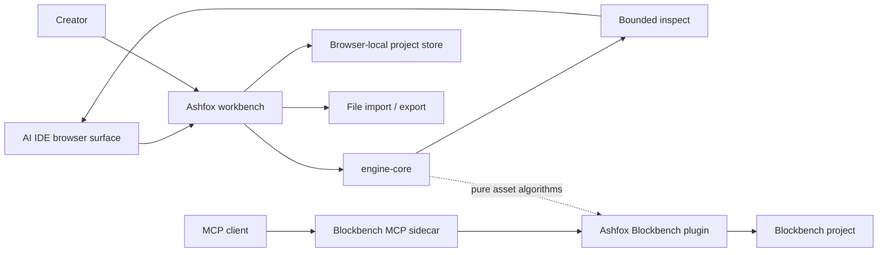

# Product Track Architecture

Status: **Accepted**

## System shape

The tracks are separate products. Ashfox workbench runs on `engine-core` and
browser-local adapters. The Blockbench integration operates its own live
project.

The public landing and documentation site is a separate source boundary, not a
separate deployment. `apps/site` reads this directory at build time and emits
static files without importing Ashfox workbench or engine code. The public
packager combines both outputs under one origin.

## Ashfox workbench

`apps/web` is the primary product.

It owns:

- the compact authoring and review experience;
- browser-local project lifecycle and revision history;
- semantic UI actions and Agent Command Port input;
- bounded agent inspection and direct command submission;
- Three.js scene projection and animation playback;
- browser import, export, and target delivery;
- local validation and artifact generation.

`packages/engine-core` owns:

- `ProjectDocument` and stable entity identity;
- immutable scene operations and command receipts;
- atomic command batches and compact execution receipts;
- invariants and target validation;
- host-independent UV packing and deterministic texture shading;
- deterministic Bedrock, GeckoLib 5, glTF, GLB, and Java exporters.

Ashfox workbench uses IndexedDB for revisioned local persistence and may use Web
Workers for browser computation. `engine-core` cannot import browser APIs.

## Blockbench MCP compatibility

The optional compatibility product preserves the existing Blockbench workflow:

- `apps/blockbench-plugin` bundles the editor plugin;
- `apps/blockbench-mcp-sidecar` bundles the MCP sidecar;
- `packages/blockbench-runtime` owns Blockbench adapters, live session
  orchestration, MCP transport, and sidecar communication;
- `packages/blockbench-contracts` owns existing MCP schemas and response DTOs;
- `packages/blockbench-conformance` protects the existing public MCP contract.

Blockbench is the live project authority in this track.

## Shared boundary

Only host-independent asset semantics may cross tracks:

- canonical document and format types;
- validators and deterministic exporters;
- UV packing and deterministic texture shading;
- import/export adapters;
- golden fixtures and tolerance rules.

MCP schemas and Blockbench globals stay in the Blockbench track. React state
and Three.js objects stay in Ashfox workbench.

## Repository map

| Area | Responsibility |
| --- | --- |
| `apps/site` | Dependency-free static landing and documentation output |
| `apps/web` | AI-native low-poly workbench |
| `packages/engine-core` | Canonical web domain and exporters |
| `apps/blockbench-plugin` | Optional Blockbench plugin bundle entry |
| `apps/blockbench-mcp-sidecar` | Optional Blockbench MCP sidecar entry |
| `packages/blockbench-runtime` | Blockbench-only execution |
| `packages/blockbench-contracts` | Blockbench MCP compatibility contracts |
| `packages/blockbench-conformance` | Blockbench MCP protocol conformance |

## Delivery flows

### Web edit

1. The browser derives a bounded inspection for the current revision.
2. The user or AI IDE submits one coarse canonical command batch.
3. `engine-core` validates and applies the immutable transition atomically.
4. Browser persistence commits the new revision.
5. The viewport rebuilds affected projections.
6. One compact receipt returns affected IDs or a blocking finding.

The detailed contracts are defined in
[AI-native low-poly authoring](ai-native-authoring.md) and
[commands and results](commands-and-results.md).

### Web export

1. A committed `ProjectDocument` is validated for a target profile.
2. The matching `engine-core` exporter creates deterministic files.
3. Ashfox workbench prepares one downloadable file, using ZIP for multi-file targets.
4. AI IDE host delivery follows the
   [Agent Command Port](agent-command-port.md).

### Blockbench MCP call

1. The sidecar validates the existing MCP request.
2. It forwards the call to the connected Blockbench plugin.
3. Blockbench adapters inspect or mutate the active Blockbench project.
4. The existing MCP response and content blocks are returned.
