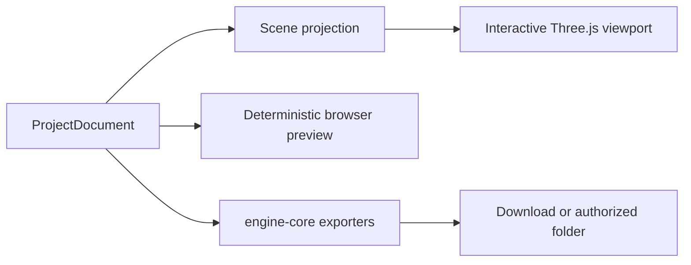
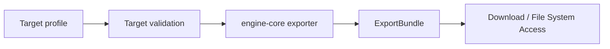

# Rendering, Assets, and Export

Status: **In progress**

## Browser scene projection

The projection resolves hierarchy, transforms, geometry, texture assignments,
UVs, visibility, and animation pose. It does not read selection or panel state.

Three.js objects are disposable. Canonical IDs remain in `ProjectDocument`.

## Interactive viewport

- nearest-neighbor texture sampling by default;
- perspective and orthographic cameras;
- selection and transform controls;
- grid, origin, pivot, and bounds overlays;
- animation playback against a stable document revision;
- responsive sizing for narrow AI IDE panes;
- explicit disposal of GPU resources.

## Deterministic preview

Preview rendering runs in the browser with a fixed render preset:

- explicit output dimensions and device scale;
- fixed camera, lighting, background, color space, and pixel ratio;
- explicit animation clip and time;
- no temporal randomness;
- renderer and preset version recorded with the result.

Heavy frame sequences may move to a Web Worker or `OffscreenCanvas`; they do not
require a server worker.

## Asset ingestion

Web Studio supports:

- drag and drop;
- file picker selection;
- bytes generated in the current browser project;
- an explicitly authorized File System Access handle;
- an existing Ashfox archive.

Ingestion validates the type and size, decodes bytes, normalizes metadata, and
creates a stable asset ID. Imported absolute paths are never stored in the
canonical document.

IndexedDB or OPFS may store local asset bytes. A selected external file remains
behind a browser handle owned by the persistence adapter.

## Deterministic Minecraft texture generation

`textures.uvAtlas.generate` applies the Blockbench MCP texture method through
the canonical reducer:

- cube faces derive width and height from their model-space axes;
- `pixelsPerBlock / modelUnitsPerBlock` fixes one texel density for every face;
- stable height/width/key sorting and row packing assign UV rectangles;
- the atlas doubles until it fits, then reduces density at the hard limit;
- directional shade, edge darkening, and coordinate-hash noise fill each UV
  rectangle while thin and tiny faces suppress destructive detail.

The browser viewport and PNG materializer use the same procedural raster
renderer. Blockbench runtime face dimensions, packing, density reduction, and
shading delegate to the same engine functions.

## Export pipeline

Implemented targets:

1. self-contained `.ashfox` project archive;
2. Minecraft Java block/item;
3. Minecraft Bedrock geometry and animation;
4. GeckoLib 5 geometry and animation;
5. glTF 2.0 JSON with resources;
6. GLB with sidecars;
7. fully self-contained GLB.

Every exporter returns a deterministic bundle with target ID, version, logical
paths, entrypoints, files, and findings. The browser materializer writes those
entries without reinterpreting model data.

Blank projects and single-file exports require no filesystem permission.
Writing into an existing project folder requires one explicit browser grant.

## Compatibility verification

Golden fixtures live in `packages/engine-core/tests/fixtures`. Bedrock,
GeckoLib, Java, and glTF results are validated against their target
specifications, schemas, and deterministic snapshots.

Web Studio rendering and export use `engine-core`. The Blockbench compatibility
track uses its renderer and codecs for Blockbench-hosted sessions.

## Cache identity

A preview or export cache key includes:

- project revision;
- renderer or exporter version;
- normalized target profile;
- referenced asset hashes.

Camera movement, selection, and overlay visibility do not invalidate artifacts.
