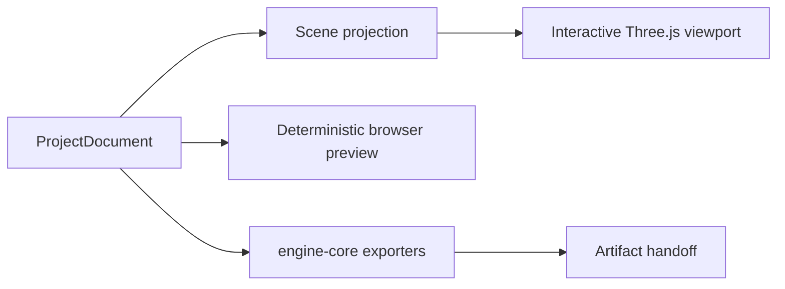
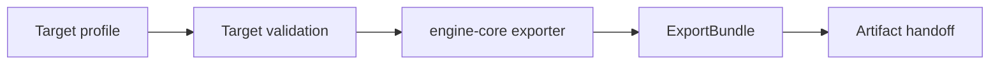

# Rendering, Assets, and Export

Status: **In progress**

## Browser scene projection

The projection resolves hierarchy, transforms, geometry, texture assignments,
UVs, visibility, and animation pose. It does not read selection or panel state.

Three.js objects are disposable. Canonical IDs remain in `ProjectDocument`.

## Interactive viewport

- nearest-neighbor texture sampling by default;
- perspective and orthographic cameras;
- selection and transform controls;
- grid, origin, pivot, and bounds overlays;
- animation playback against a stable document revision;
- deterministic Studio, Day, Evening, and Night environments;
- responsive sizing for narrow AI IDE panes;
- explicit disposal of GPU resources.

## Deterministic preview

Preview rendering runs in the browser with a fixed render preset:

- explicit output dimensions and device scale;
- fixed camera, lighting, background, color space, and pixel ratio;
- explicit animation clip and time;
- no temporal randomness;
- renderer and preset version recorded with the result.

Heavy frame sequences may move to a Web Worker or `OffscreenCanvas`; they do not
require a server worker.

## GIF capture

The Capture menu has two deterministic local modes.

`Build process` reads the current canonical history branch. It joins each
retained `ProjectDocument` snapshot to its command receipt by revision, groups
short bursts of related changes, and emits semantic Start, Project, Geometry,
Rig, Texture, Animation, and Complete events. It stores no second history and
never invents a replay from receipts that do not have matching snapshots.
Reloaded projects therefore begin a new capture session.

Each event renders only after its command batch has committed. Geometry changes
appear as stable cuts, animation events and the final review play the first
available clip, the perspective camera follows one bounded deterministic arc,
and event cards plus a progress line make the construction sequence readable.

`Animation` captures the selected clip without mutating live playback or the
canonical document:

1. sample the clip on a fixed 10fps clock;
2. map sound, particle, and timeline triggers to their nearest sampled frame;
3. render every frame at 640 × 360 through the same camera, scene projection,
   lighting, and environment authority as the live viewport;
4. burn the clip time and triggered event labels into the review image;
5. encode and download one looping GIF entirely in the browser.

Both modes are cancellable file operations. Progress, cancellation, encoding
errors, and duplicate requests settle through the existing file-operation state
machine, so the workbench cannot remain in a stale working state. A capture is
limited to 300 frames to keep memory and browser time bounded.

## Asset ingestion

Ashfox workbench supports:

- drag and drop;
- file picker selection;
- bytes generated in the current browser project;
- an existing Ashfox archive.

Ingestion validates the type and size, decodes bytes, normalizes metadata, and
creates a stable asset ID. Imported absolute paths are never stored in the
canonical document.

IndexedDB stores local asset bytes with the revisioned project snapshot. A
selected external file is read for the current import and does not become a
writable project location.

## Deterministic Minecraft texture generation

`textures.uvAtlas.generate` applies the Blockbench MCP texture method through
the canonical reducer:

- cube faces derive width and height from their model-space axes;
- `atlasMode: generate` gives the generator ownership of face UVs and raster
  pixels; `preserve` or an omitted mode keeps authored or imported textures
  byte-for-byte intact;
- `pixelsPerBlock / modelUnitsPerBlock` fixes one texel density for every face;
- stable height/width/key sorting and row packing assign UV rectangles;
- the atlas doubles until it fits, then reduces density at the hard limit;
- directional shade, edge darkening, and coordinate-hash noise fill each UV
  rectangle while thin and tiny faces suppress destructive detail.

The browser viewport and PNG materializer use the same procedural raster
renderer. Blockbench runtime face dimensions, packing, density reduction, and
shading delegate to the same engine functions.

## Export pipeline

Implemented targets:

1. self-contained `.ashfox` project archive;
2. Minecraft Java block/item;
3. Minecraft Bedrock geometry and animation;
4. GeckoLib 5 geometry and animation;
5. glTF 2.0 JSON with resources;
6. GLB with sidecars;
7. fully self-contained GLB.

Every exporter returns a deterministic bundle with target ID, version, logical
paths, entrypoints, files, and findings. The browser materializer writes those
entries without reinterpreting model data.

Single-file targets download directly. Multi-file targets download as one ZIP.
The browser never claims a workspace write. AI IDE host delivery is defined by
the [Agent Command Port](agent-command-port.md).

## Compatibility verification

Golden fixtures live in `packages/engine-core/tests/fixtures`. Bedrock,
GeckoLib, Java, and glTF results are validated against their target
specifications, schemas, and deterministic snapshots.

Ashfox workbench rendering and export use `engine-core`. The Blockbench compatibility
track uses its renderer and codecs for Blockbench-hosted sessions.

## Cache identity

A preview or export cache key includes:

- project revision;
- renderer or exporter version;
- normalized target profile;
- referenced asset hashes.

Camera movement, selection, and overlay visibility do not invalidate artifacts.
